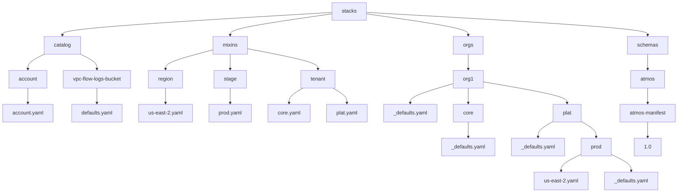

```mermaid
graph TD;
    stacks_catalog["catalog"];
    stacks_catalog_account["account"];
    stacks_catalog_account_account_yaml["account.yaml"];
    stacks_catalog_vpc-flow-logs-bucket["vpc-flow-logs-bucket"];
    stacks_catalog_vpc-flow-logs-bucket_defaults_yaml["defaults.yaml"];
    stacks_mixins["mixins"];
    stacks_mixins_region["region"];
    stacks_mixins_region_us-east-2_yaml["us-east-2.yaml"];
    stacks_mixins_stage["stage"];
    stacks_mixins_stage_prod_yaml["prod.yaml"];
    stacks_mixins_tenant["tenant"];
    stacks_mixins_tenant_core_yaml["core.yaml"];
    stacks_mixins_tenant_plat_yaml["plat.yaml"];
    stacks_orgs["orgs"];
    stacks_orgs_org1["org1"];
    stacks_orgs_org1__defaults_yaml["_defaults.yaml"];
    stacks_orgs_org1_core["core"];
    stacks_orgs_org1_core__defaults_yaml["_defaults.yaml"];
    stacks_orgs_org1_plat["plat"];
    stacks_orgs_org1_plat__defaults_yaml["_defaults.yaml"];
    stacks_orgs_org1_plat_prod["prod"];
    stacks_orgs_org1_plat_prod_us-east-2_yaml["us-east-2.yaml"];
    stacks_orgs_org1_plat_prod__defaults_yaml["_defaults.yaml"];
    stacks_schemas["schemas"];
    stacks_schemas_atmos["atmos"];
    stacks_schemas_atmos_atmos-manifest["atmos-manifest"];
    stacks_schemas_atmos_atmos-manifest_1_0["1.0"];
    stacks --> stacks_catalog;
    stacks_catalog --> stacks_catalog_account;
    stacks_catalog_account --> stacks_catalog_account_account_yaml;
    stacks_catalog --> stacks_catalog_vpc-flow-logs-bucket;
    stacks_catalog_vpc-flow-logs-bucket --> stacks_catalog_vpc-flow-logs-bucket_defaults_yaml;
    stacks --> stacks_mixins;
    stacks_mixins --> stacks_mixins_region;
    stacks_mixins_region --> stacks_mixins_region_us-east-2_yaml;
    stacks_mixins --> stacks_mixins_stage;
    stacks_mixins_stage --> stacks_mixins_stage_prod_yaml;
    stacks_mixins --> stacks_mixins_tenant;
    stacks_mixins_tenant --> stacks_mixins_tenant_core_yaml;
    stacks_mixins_tenant --> stacks_mixins_tenant_plat_yaml;
    stacks --> stacks_orgs;
    stacks_orgs --> stacks_orgs_org1;
    stacks_orgs_org1 --> stacks_orgs_org1__defaults_yaml;
    stacks_orgs_org1 --> stacks_orgs_org1_core;
    stacks_orgs_org1_core --> stacks_orgs_org1_core__defaults_yaml;
    stacks_orgs_org1 --> stacks_orgs_org1_plat;
    stacks_orgs_org1_plat --> stacks_orgs_org1_plat__defaults_yaml;
    stacks_orgs_org1_plat --> stacks_orgs_org1_plat_prod;
    stacks_orgs_org1_plat_prod --> stacks_orgs_org1_plat_prod_us-east-2_yaml;
    stacks_orgs_org1_plat_prod --> stacks_orgs_org1_plat_prod__defaults_yaml;
    stacks --> stacks_schemas;
    stacks_schemas --> stacks_schemas_atmos;
    stacks_schemas_atmos --> stacks_schemas_atmos_atmos-manifest;
    stacks_schemas_atmos_atmos-manifest --> stacks_schemas_atmos_atmos-manifest_1_0;
```